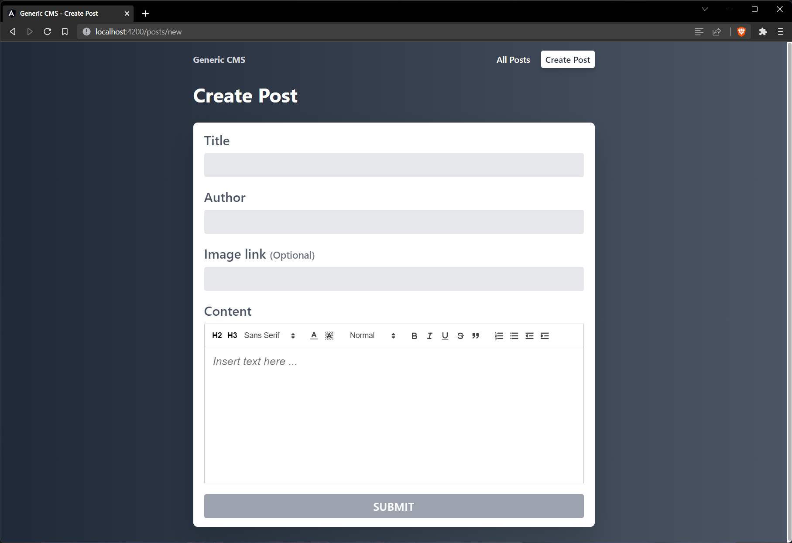

# Generic CMS Frontend



A frontend built for a generic CMS that is used to manage posts for a blog site
built with [Angular][angular-site]. This project depends on the backend API from
the [srijan-nayak/cms-backend][cms-backend-repo] project.

## Running the project locally.

### Start backend API

Ensure that the backend API is running on [localhost:3300](http://localhost:3300)
by following the instructions from the [cms-backend repository][cms-backend-repo].

### Clone and install dependencies

```bash
git clone https://github.com/srijan-nayak/generic-cms-frontend.git
cd generic-cms-frontend
npm install
```

### Start the development server

```bash
npm start
```

The application will be accessible on [localhost:3300](http://localhost:4200/)

[angular-site]: https://angular.io/ "Angular framework landing page"
[cms-backend-repo]: https://github.com/srijan-nayak/cms-backend "cms-backend repository"
